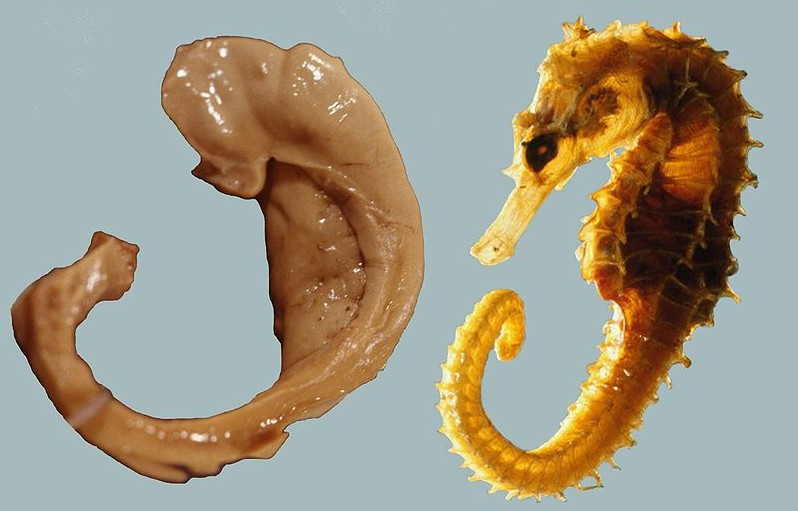

# Quantifying-Hippocampus-Volume-for-Alzheimer-s-Progression

## **Background**

Alzheimer's disease (AD) is a progressive neurodegenerative disorder that results in impaired neuronal (brain cell) function and eventually, cell death. AD is the most common cause of dementia. Clinically, it is characterized by memory loss, inability to learn new material, loss of language function, and other manifestations.

For patients exhibiting early symptoms, quantifying disease progression over time can help direct therapy and disease management.

A radiological study via MRI exam is currently one of the most advanced methods to quantify the disease. In particular, the measurement of hippocampal volume has proven useful to diagnose and track progression in several brain disorders, most notably in AD. Studies have shown a reduced volume of the hippocampus in patients with AD.

The hippocampus is a critical structure of the human brain (and the brain of other vertebrates) that plays important roles in the consolidation of information from short-term memory to long-term memory. In other words, the hippocampus is thought to be responsible for memory and learning (that's why we are all here, after all!)

Hippocampus

Source: Life Science Databases (LSDB). Hippocampus. Images are from Anatomography maintained by Life Science Databases (LSDB). (2010). CC-BY-SA 2.1jp. [Link](https://commons.wikimedia.org/wiki/File:Hippocampus_small.gif)

Humans have two hippocampi, one in each hemisphere of the brain. They are located in the medial temporal lobe of the brain. Fun fact - the word "hippocampus" is roughly translated from Greek as "horselike" because of the similarity to a seahorse observed by one of the first anatomists to illustrate the structure, but you can also see the comparison in the following image.

Seahorse & Hippocampus

Source: Seress, Laszlo. Laszlo Seress' preparation of a human hippocampus alongside a sea horse. (1980). CC-BY-SA 1.0. [Link](https://commons.wikimedia.org/wiki/File:Hippocampus_and_seahorse.JPG)

According to [Nobis et al., 2019](https://www.sciencedirect.com/science/article/pii/S2213158219302542), the volume of hippocampus varies in a population, depending on various parameters, within certain boundaries, and it is possible to identify a "normal" range taking into account age, sex and brain hemisphere.

You can see this in the image below where the right hippocampal volume of women across ages 52 - 71 is shown.

Nomogram - Female, Right Hippocampus Volume, Corrected for Head Size

Source: Nobis, L., Manohar, S.G., Smith, S.M., Alfaro-Almagro, F., Jenkinson, M., Mackay, C.E., Husain, M. Hippocampal volume across age: Nomograms derived from over 19,700 people in UK Biobank. Neuroimage: Clinical, 23(2019), pp. 2213-1582.

There is one problem with measuring the volume of the hippocampus using MRI scans, though - namely, the process tends to be quite tedious since every slice of the 3D volume needs to be analyzed, and the shape of the structure needs to be traced. The fact that the hippocampus has a non-uniform shape only makes it more challenging. Do you think you could spot the hippocampi in this axial slice below?

Axial slice of an MRI image of the brain

As you might have guessed by now, we are going to build a piece of AI software that could help clinicians perform this task faster and more consistently.

You have seen throughout the course that a large part of AI development effort is taken up by curating the dataset and proving clinical efficacy. In this project, we will focus on the technical aspects of building a segmentation model and integrating it into the clinician's workflow, leaving the dataset curation and model validation questions largely outside the scope of this project.

## **The Dataset**

We are using the "Hippocampus" dataset from the [Medical Decathlon competition](http://medicaldecathlon.com/). This dataset is stored as a collection of NIFTI files, with one file per volume, and one file per corresponding segmentation mask. The original images here are T2 MRI scans of the full brain. As noted, in this dataset we are using cropped volumes where only the region around the hippocampus has been cut out. This makes the size of our dataset quite a bit smaller, our machine learning problem a bit simpler and allows us to have reasonable training times. You should not think of it as "toy" problem, though. Algorithms that crop rectangular regions of interest are quite common in medical imaging. Segmentation is still hard.

The proposed piece of AI software could be integrated into a clinical-grade viewer and automize the measuring of hippocampal volumes of patients as soon as their studies are committed to the clinical image archive.

**Intended use of the product:**

The suggested AI product could be applied to patients with early symptoms of Alzheimer's Disease Progression with the hippocampus of volumes (in mm³) that range from 2200 mm³ to 4500 mm³, independents of age and gender (as described in the following histogram).

**Data description**

Each image of an MRI scans is represented as a single file and corresponding mask. Each mask has three unique labels:

- anterior segment of the hippocampus (corresponding to class 1)
- posterior segment of the hippocampus (corresponding to class 2)
- background

**Image info** : 32 bits per pixel is used, the first dimension represents sagittal slices, the second represents coronal ones and the third - is axial.

**Training phase:**

For training the neural network (UNet) the cropped barin scans from every image series for simplicity. Note, only scans of the right hippocampus were used to build this model.

**Ground truth:**

The ground truth labels were obtained from highly qualified radiologists, who made annotation and converted the data to NIFTI format.

**Training Performance:**

The orange line represents a loss on the training set for each 10th batch and the blue one represents validation. Note, that the data which was used for validation is new and have never been used during the training phase.

The average Dice metric on the test set is 0.9 and the Jacckard metric is 0.88.

The resulting masks look as follows:

The model is integrated into a working clinical PACS (Picture Archiving and Communication System) which can be applied on every study and generate a report with volume measurements.
